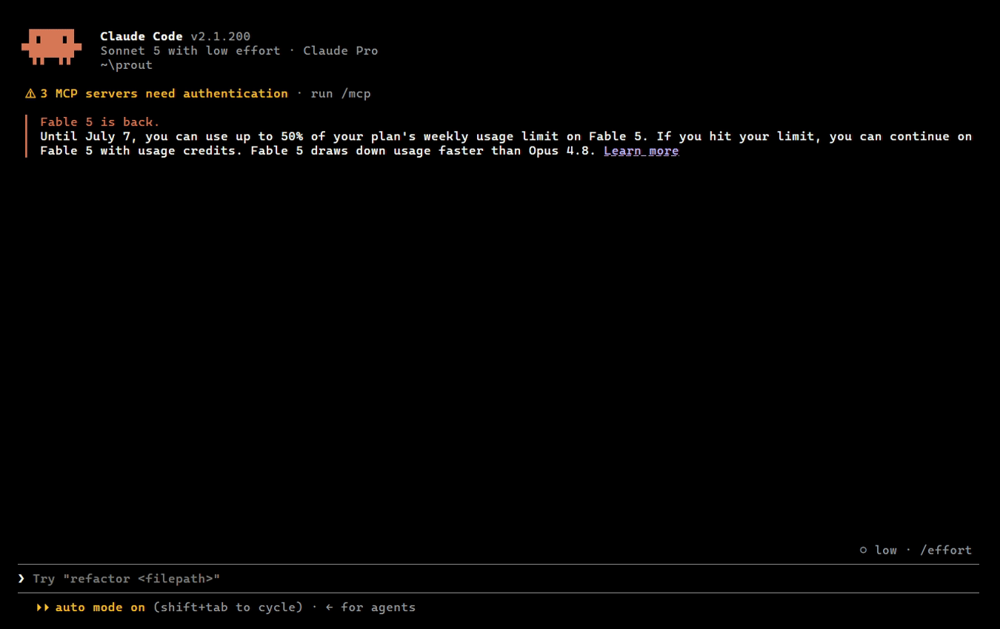

# Prout: Local Credential Leases for Agents

Prout is a local credential lease service for AI agents and automation. An agent states why it needs a specific credential, Prout uses Gemma 4 locally to understand why that credential is required and grant or deny. Prout provides temporary leases to execute commands with the credential or expose the raw credential in rare cases. All actions are kept in a append only log allowing conflict free sync'ing of the vault across machines.



Credentials are stored in an encrypted vault. The daemon decrypts them into locked memory after unlock and serves local CLI requests over an AF_UNIX socket using length-prefixed JSON frames. Credentials may be disclosed only through active leases, in one of two policy modes:

The model recommends; code enforces. Unknown services, malformed arbiter output, unknown verdicts, zero ceilings, bad disclosure modes, and requests exceeding policy ceilings are denied or rejected before credential release.

## Why?

Often, I'm tempted to give agents my passwords, either by environment variable or pasting into a chat. I feel guilty each time. I want to provide Claude, Antigravity and Codex access to specific credentials and audit the "why?".

Prout provides the layer on top of my vault to autonomously question agents on why they need access to a credential.


## Warning

This code was done as part of a hackathon, it is at prototype level and not meant for real usage. It is still vulnerable to many prompt injections that could be used to provide full access.

## Installation

After installing a build and creating a vault. Install the skill to your agent found under [./skills](./skills).

## Current Commands

**Inject**: the secret is set in an environment variable for commands to read from in a subshell.

**Expose**: provide the raw unfiltered secret value to an agent.

```powershell
prout vault init
prout vault add <service> --inject-env <VAR> --disclosure inject|reveal --max-ttl <sec> --max-uses <n>
prout vault edit <service> [metadata/policy flags]
prout vault rotate <service>
prout vault delete <service>
prout vault list
prout vault history <service>
prout vault verify

prout serve [--model <path>] [--backend cpu|gpu] [--vault <dir>]

prout run --service <service> --intent "<why>" [--agent <name>] -- <cmd...>
prout run --conversation <id> --details "<answer>" [--agent <name>]
prout execute --lease <approved-lease-id>

prout expose --service <service> --intent "<why>" [--agent <name>]
prout expose --conversation <id> --details "<answer>" [--agent <name>]
prout expose --lease <approved-lease-id>

prout audit tail [--n <count>]
prout audit conversation <conversation-id>
prout audit verify
```

Exit codes are stable for agents: `0` success, `1` error, `10` question, `11` denied.

## Run and Execute Flow

Use one terminal for the daemon, it provides access via local secure socket:

```powershell
prout serve --model C:\Users\eerwi\models\gemma-4-E2B-it-litert-lm\gemma-4-E2B-it.litertlm --backend gpu
```

Use another terminal to negotiate a credential lease. The first `run` call for a run conversation must include the command after `--`. `run` stores that command with the conversation, but does not execute it; it returns safe JSON metadata and, when approved, a `lease_id` for execution.

```powershell
prout run --service ml.huggingface --intent "checking the token is valid against the website" --agent local -- powershell -NoProfile -Command "curl.exe -4 -H ('Authorization: Bearer ' + `$env:HF_TOKEN) 'https://huggingface.co/api/whoami-v2'"
```

If the response has `"status":"question"`, answer with the returned conversation id. The original command remains stored with that conversation unless the request is denied or the conversation times out:

```powershell
prout run --conversation <question-conversation-id> --details "Validate the Hugging Face token with the whoami API once, without changing account state." --agent local
```

When the response has `"status":"granted"`, pass its `lease_id` to `execute`. For inject services, the grant response also includes `"env_var":"HF_TOKEN"` or the configured variable name, so callers can see which child-process environment variable will receive the credential. This example assumes the service was added with `--inject-env HF_TOKEN`.

```powershell
prout execute --lease <approved-lease-id>
```

## Arbiter Schema

The external arbiter response format is one JSON object:

```json
{"type":"question","question":"What specifically will you do?"}
```

```json
{"type":"lease","ttl_seconds":300,"max_uses":1,"rationale":"Read-only diagnostic intent."}
```

```json
{"type":"deny","rationale":"Intent is too vague for this credential."}
```

Lease terms are clamped to the service policy ceilings in code.

## Environment

- `PROUT_HOME`: vault and audit directory. Defaults to `%LOCALAPPDATA%\prout` on Windows and `~/.prout` elsewhere.
- `PROUT_SOCKET`: daemon AF_UNIX socket path.
- `PROUT_PASSPHRASE`: non-interactive vault passphrase for tests and demos.
- `PROUT_MACHINE`: machine id used for `audit-<machine>.jsonl` and `vault-<machine>.jsonl`.
- `PROUT_CREDENTIAL`: non-interactive credential input for `vault add` and `vault rotate`.

## Build

LiteRT-LM is vendored under `third_party/litert-lm/` and must not be modified. Build its C ABI shared library once with Bazel, then build Prout with CMake.

```powershell
cd third_party/litert-lm
bazelisk build //c:litert-lm --config=windows -c opt

cd ..\..
cmake --preset windows-release
cmake --build --preset windows-release
ctest --preset windows-release
```

## Audit Log

Each machine appends only to its own `audit-<machine>.jsonl` file. Records are hash-chained and contain safe metadata: conversation ids, intent/details, service, verdict, rationale, lease terms, disclosure mode, command summaries, child exit codes, and redaction flags. Credential values and raw command output are never written to audit records. `prout audit conversation <id>` shows one conversation newest first, and `prout audit verify` recomputes the chain and detects manual record corruption.

## Vault Log

Each machine appends vault mutations to its own encrypted `vault-<machine>.jsonl` file. Syncing a vault directory is a file union: Prout verifies every hash chain, decrypts records with the vault passphrase, and replays metadata, policy, credential rotations, and tombstones into the effective service state. `vault history` shows safe revision metadata only; credential values stay encrypted except during authorized lease delivery.

## Security Invariants

1. Credentials never leave locked memory except across the local IPC/CLI boundary for an authorized lease delivery, and never into logs, audit records, errors, or normal `run` output.
2. The audit log is append-only. Prout never rewrites, reorders, or truncates existing records.
3. The model recommends; code enforces. No arbiter verdict authorizes decryption or delivery until validated against service policy.
4. `inject` and `reveal` are explicit policy modes. `expose` is denied for inject-only services.
5. `third_party/litert-lm/` is a vendored submodule and is not edited by Prout changes.

## Roadmap

Web vault management, Ed25519-signed records, and curl proxy/request execution modes.
